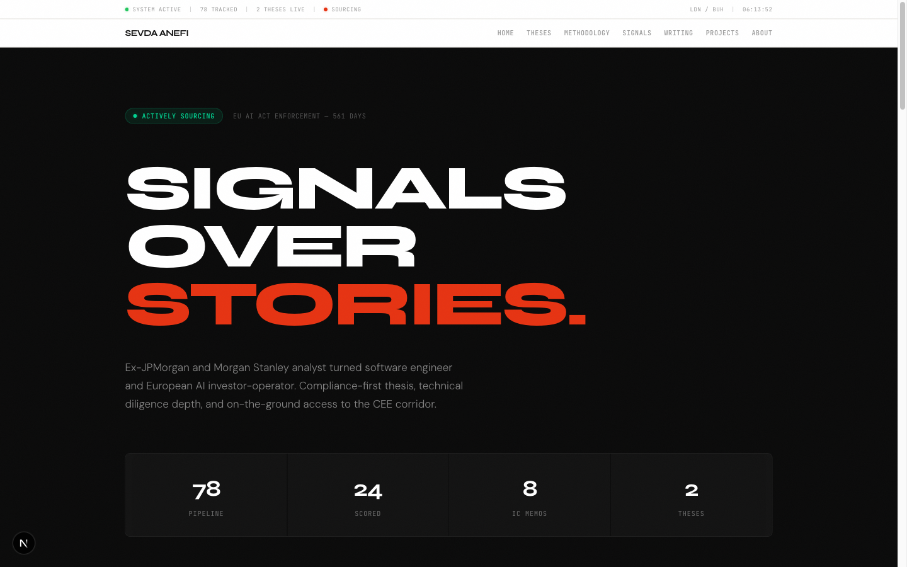
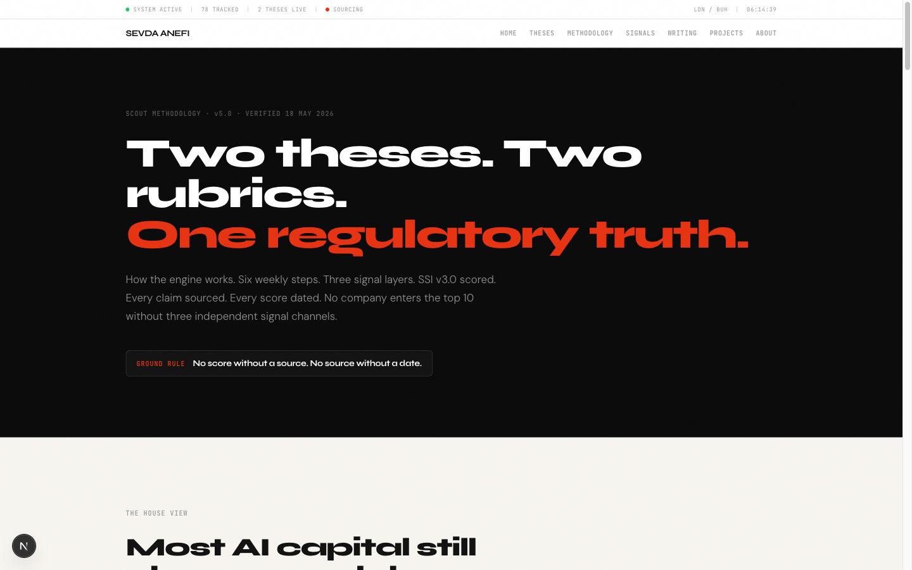
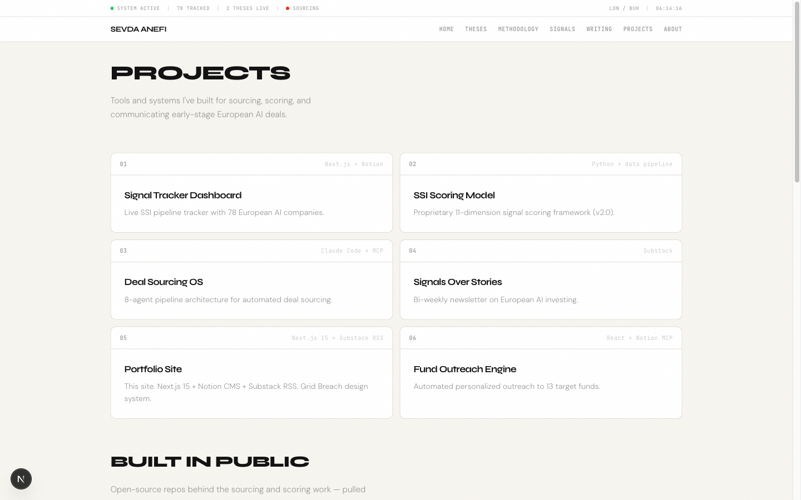

# Signals Over Stories

**[Sevda Anefi](https://vc-portfolio-website.vercel.app/)** — early-stage European AI investor-operator.
The working portfolio behind a systematic approach to sourcing and scoring pre-seed
to Series A AI companies in regulated European markets.

**Live → [vc-portfolio-website.vercel.app](https://vc-portfolio-website.vercel.app/)**



> Signals over stories. Filings over feelings. Buyers over vibes.

---

## The house view

European AI value is moving from models to the layers that make models *deployable* and
*durable* in regulated industries. Models commoditize on every release; governance and
system-of-record gravity compound. The portfolio runs on two theses and a scoring system
that ranks companies by signal, not narrative.

## Two theses

| Thesis | Conviction | The bet |
| --- | :---: | --- |
| **GAO** — Governed Agentic Ops | **92** | The next durable AI infrastructure layer is not a model, it's the deployment gateway: runtime governance, observability, evaluation, and audit evidence for the agents regulated enterprises are about to ship. *Deployment permission compounds.* |
| **VSRAI** — Vertical System-of-Record AI | **82** | AI that becomes, extends, or controls the system of record in regulated industries. Horizontal copilots compress; products that write back into the clinical, legal, or financial record compound. *Workflow gravity beats model novelty.* |

## The method — SSI

The **Signal Strength Index (SSI)** is a 100-point rubric scored per thesis across eight
weighted dimensions — from *Regulatory Embeddedness* and *Runtime Governance Architecture*
(GAO) to *System-of-Record Integration Depth* and *Domain Data Advantage* (VSRAI). Scores
route companies into action tiers:

| Tier | SSI | Action |
| :---: | :---: | --- |
| **P0** | 80+ | Act within 48h — founder call, source validation, memo stub |
| **P1** | 65–79 | Deep dive this week |
| **P2** | 50–64 | Monitor for a strengthening signal |
| **P3** | <50 | Watchlist |

Signals are gathered across **three layers**, in order of alpha:

1. **Regulatory Proximity** — AI Act sandboxes, competent authorities, CEN-CENELEC / ISO
   standards work, procurement portals. Highest alpha, outside the standard VC information surface.
2. **Technical Architecture** — repos, docs, SDKs, security posture, write-back and runtime
   evidence. Separates real products from confident landing pages.
3. **Market Timing & Momentum** — hiring velocity, grants, named customer references. Confirmatory.

Timing is anchored to a live regulatory map — the EU AI Act, the Digital Omnibus, DORA, NIS2,
EHDS, and AMLA — each tied to the thesis it pressures.

## What's inside

- **Home** — the house view: both theses and the SSI pipeline at a glance.
- **Theses** — GAO and VSRAI in full: conviction, control points, buyer pain, kill criteria.
- **Methodology** — the SSI rubrics, the three-layer signal architecture, and the regulatory map.
- **Signals** — the live pipeline, top companies ranked by SSI.
- **Projects** — tools built for sourcing and scoring, plus open-source repos pulled live from GitHub.
- **Writing** — *Signals Over Stories* essays, synced from Substack.

## Engineering

Built the way the tools worth backing are built — typed, server-first, and resilient.

- **Next.js 16** — App Router, React 19, Turbopack; Server Components by default
- **TypeScript** — strict mode, no `any`
- **Tailwind CSS 4** — the *Grid Breach* design system, one accent color
- **Motion** — scroll-triggered animation on a single shared easing curve

**Two-speed data model.** Live content (essays via Substack RSS, repos via the GitHub API) is
fetched on a 1-hour ISR cycle, each with a hardcoded fallback so the site never blanks if an
upstream is down. Investment positioning — theses, signals, scoring — is static canon, compiled
in and changed deliberately, sourced from a canonical Notion CV + Investor Profile.

## Operator background

Structured products at **Morgan Stanley** and **JPMorgan** → production engineering at
**DAZN**, **Funding Circle**, and **Duffel** → early-stage European AI via **Antler** and
**anefi.vc**. Based between London and Bucharest.

## Local development

```bash
npm install
npm run dev      # http://localhost:3000
```

```bash
npm run build    # production build
npm run start    # serve the production build
```

## Screenshots

| Methodology                                           | Projects                                        |
| ----------------------------------------------------- | ----------------------------------------------- |
|  |  |

---

Built by [Sevda Anefi](https://vc-portfolio-website.vercel.app/). Deployed on Vercel.
